# Cosift Open Contribution Network — Flow Diagrams

Companion to `PLAN-contrib-network.md`. Each diagram answers one question and
references the workstreams (WS0-WS15) implementing it. Mermaid renders natively
on GitHub.

Diagram index:

1. [System overview — layers and trust boundaries](#1-system-overview)
2. [End-to-end story — developer publishes → AI agent retrieves](#2-end-to-end-story)
3. [Component map of the broker](#3-component-map-of-the-broker)
4. [Publisher: claim + verify a docs prefix](#4-publisher-claim-and-verify)
5. [Publisher: heartbeat + lease lifecycle](#5-publisher-heartbeats-and-lease-state)
6. [Publisher: lease state machine](#6-lease-state-machine)
7. [Worker: install → register → ready](#7-worker-install-and-register)
8. [Worker: fetch contribution lifecycle](#8-fetch-contribution-lifecycle)
9. [Worker: embed contribution lifecycle](#9-embed-contribution-lifecycle)
10. [Frontier lanes and work distribution](#10-frontier-lanes-and-work-distribution)
11. [Quarantine → verify → promote pipeline](#11-quarantine-verify-promote-pipeline)
12. [Retrieval path with gating](#12-retrieval-path-with-gating)
13. [Transport binding — Pilot tunnel identity check (I9)](#13-transport-binding-i9)
14. [Principal reputation state machine](#14-principal-reputation)
15. [Multi-broker federation (forward-compat)](#15-multi-broker-federation-future)

---

## 1. System overview

Three planes — humans/agents at the top, Pilot overlay in the middle, the broker (cosift on GH200) at the bottom. Every contribution byte crosses the middle plane (**I9**).

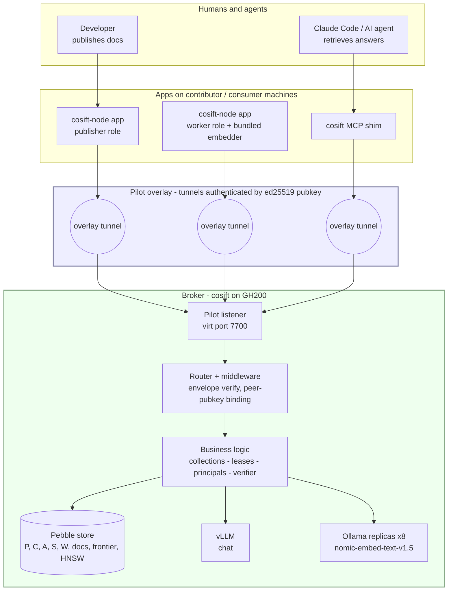

Trust boundaries: every arrow crossing into the broker is overlay-authenticated; the envelope signing key equals the tunnel peer pubkey.

---

## 2. End-to-end story

The full loop from a dev shipping docs to an AI agent retrieving an answer. Time flows top-to-bottom; only happy-path events shown.

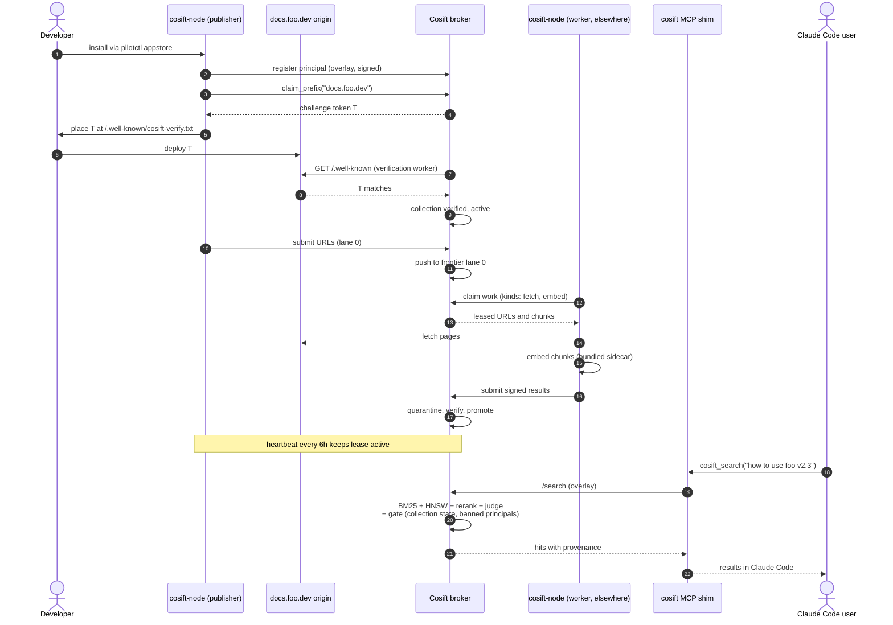

The lease is what makes "active only while installed" true: the developer's app stops heartbeating when uninstalled, lease lapses, docs leave the index.

---

## 3. Component map of the broker

Zoom into one cosift instance. Routes split by auth surface; background loops sit on the side.

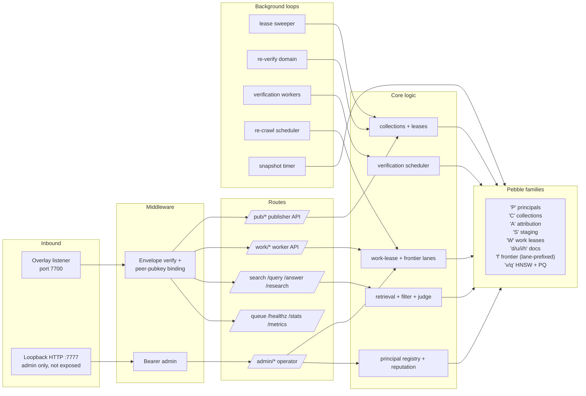

`/admin/*` routes only exist on loopback HTTP behind the operator's admin token — the overlay listener refuses them outright (route allowlist).

---

## 4. Publisher claim and verify

Domain ownership without a central account system. The well-known token is the proof; the broker re-verifies every 30 days.

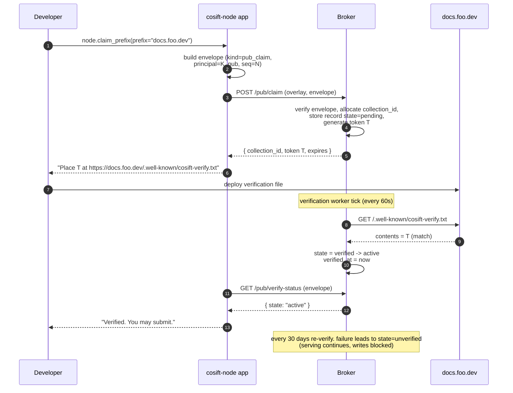

Conflicting claims: longest-prefix nesting; first verified wins. A second principal claiming the same exact prefix → 409 immediately.

---

## 5. Publisher heartbeats and lease state

Nonce-chained heartbeats (**D1**) — the response carries the next nonce; replay-proof without inbound delivery. App uninstall = identity destroyed = heartbeats stop = lease lapses.

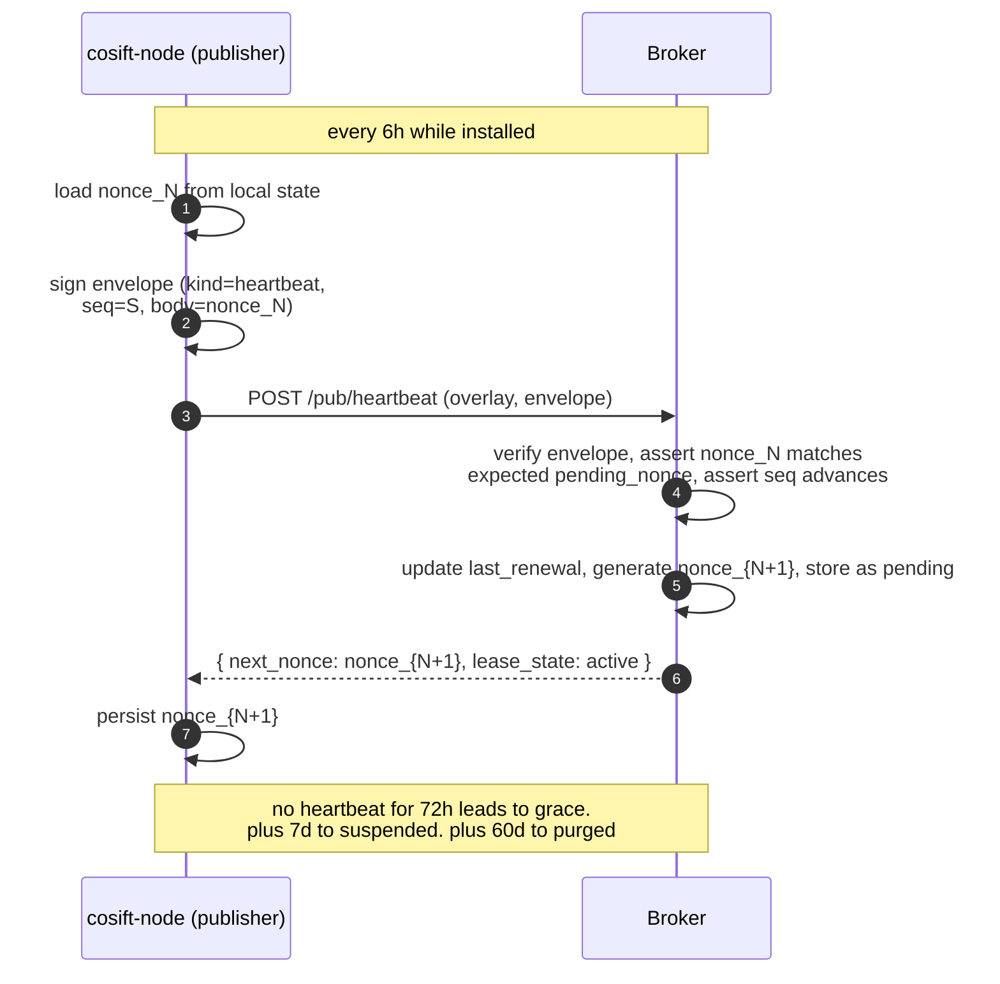

Sweeper goroutine ticks once a minute; transitions are flag flips on the `'C'` record + an in-memory suspended-set update consumed by retrieval gating (WS6).

---

## 6. Lease state machine

Two state machines live on a collection: the **lease** (presence-driven, this diagram) and the **verification** state (active vs unverified, which gates writes but never serving).

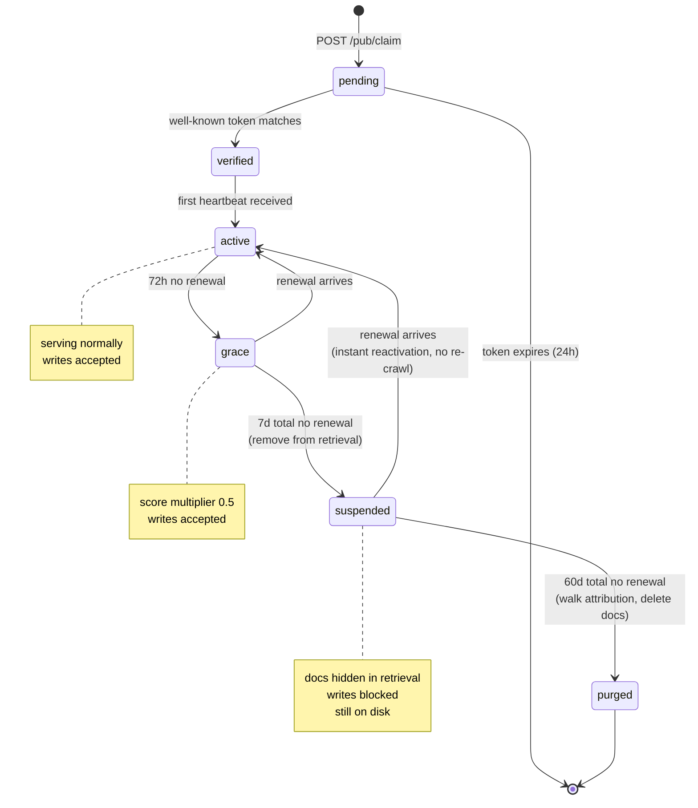

Generous timings: a laptop on vacation doesn't nuke a publisher's docs.

---

## 7. Worker install and register

Self-contained — no ollama, no python. The bundle ships the embed runtime and model weights.

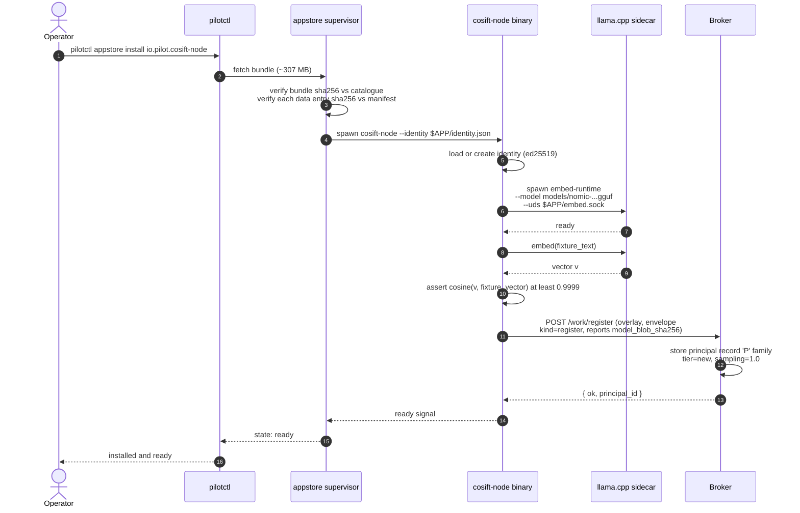

If the fixture check fails, the app stays alive for `node.status` but `node.worker_start` returns `runtime_not_ready` — never enters the loop with a tampered model.

---

## 8. Fetch contribution lifecycle

Claim → fetch → submit → quarantine → sampled verify → promote (or reject). Politeness stays server-controlled.

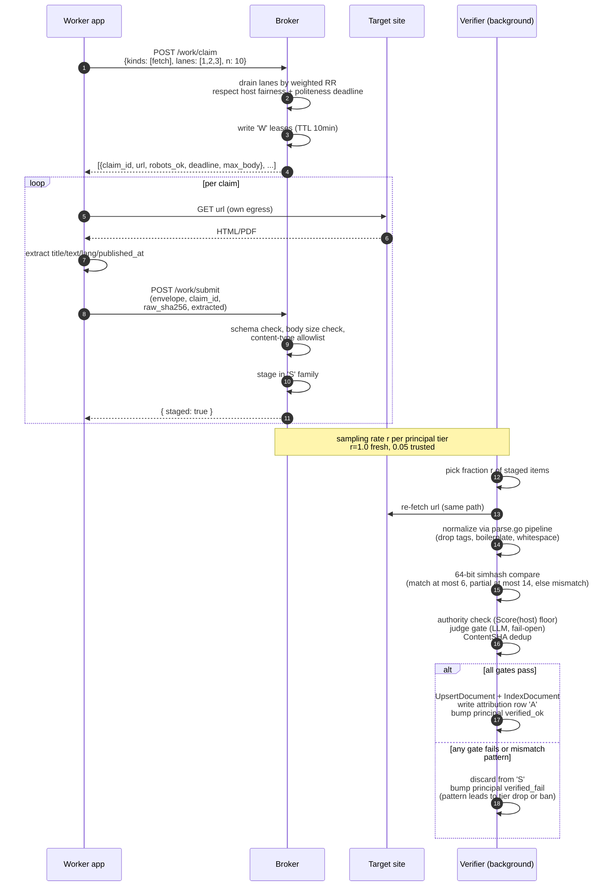

Same churn-aware grading prevents single-doc slashing — a contributor goes down only on a *pattern* of mismatches.

---

## 9. Embed contribution lifecycle

Verification is sharper here than for content — same model + same blob = deterministic match, cosine ≥ 0.9999.

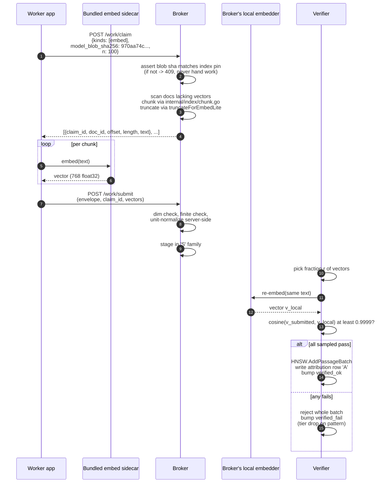

Server defines the text (**I6**) — contributors never get to choose the input, which collapses the verification problem into "did you compute the right vector for this text."

---

## 10. Frontier lanes and work distribution

The frontier is a single keyspace with a lane byte; weighted drain prevents bulk from starving submissions.

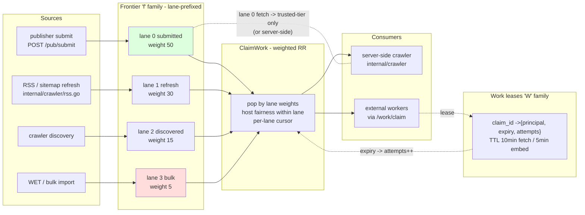

If lane 0 is empty its share redistributes to other lanes; deterministic weighted RR keeps statistical fairness across many claims.

---

## 11. Quarantine, verify, promote pipeline

The atomic gate: nothing reaches the main index without passing every check for its kind.

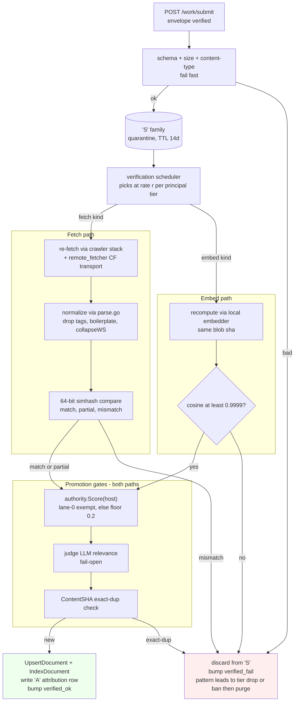

`partial` for content is neutral (page churn — ads, timestamps); only a *pattern* of mismatches drops a tier.

---

## 12. Retrieval path with gating

One choke point covers `/search`, `/query`, `/answer`, `/research`: the post-`retrieve()` filter loop. Suspended collections + banned principals filtered there cheaply via the docMeta v2 packed blob.

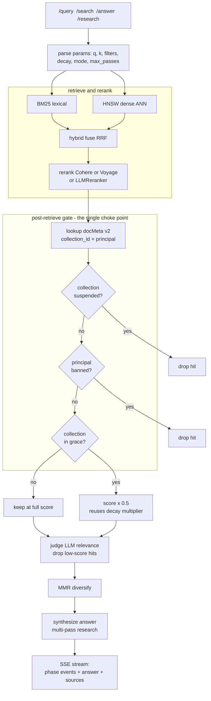

Same machinery for every retrieval endpoint — invariant **I8** enforced by sharing one function, not four.

---

## 13. Transport binding (I9)

The contribution-path proof: the envelope's signing key must equal the Pilot tunnel's authenticated peer pubkey. Forge either side, broker refuses.

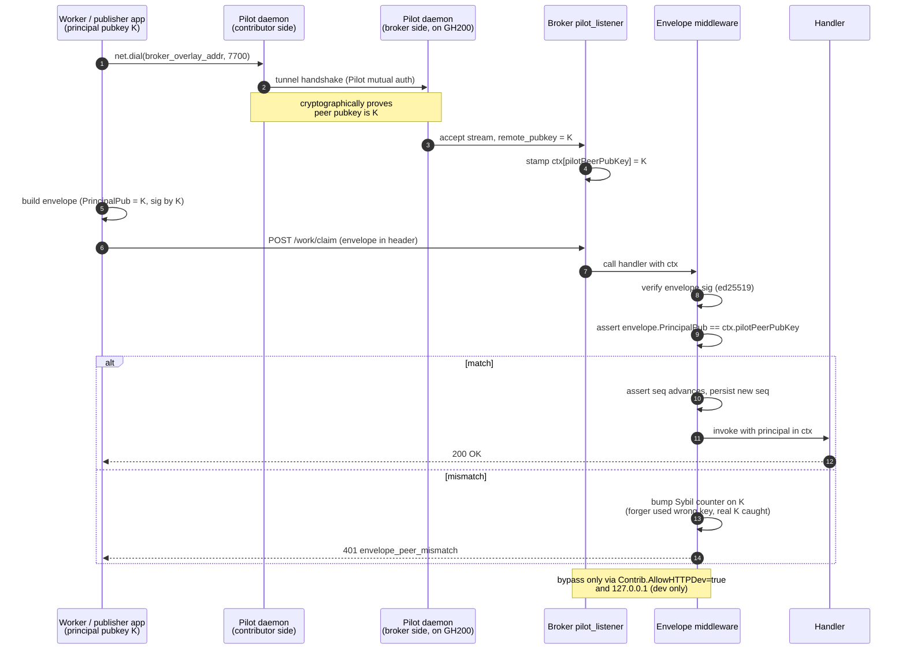

Public HTTPS via Caddy 404s these routes — overlay is the only network-reachable path.

---

## 14. Principal reputation

Sampling rate is the lever — fresh keys verified at 100%, earned trust lowers it; mismatch patterns drop you back or ban you.

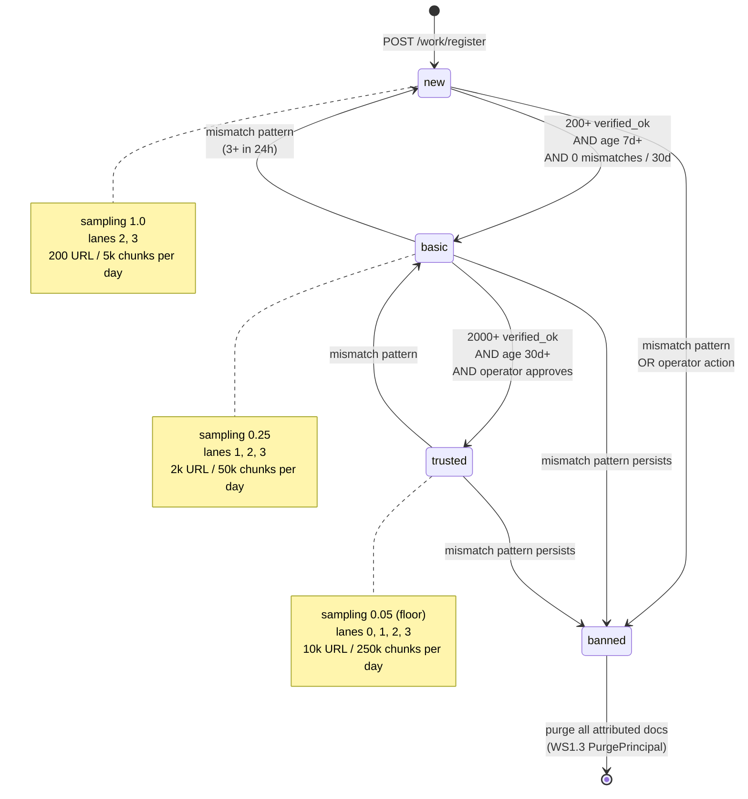

Expected un-caught bad submissions per burned identity ≈ (1−r)/r → 0 / 3 / 19. Purge (**I4**) reverses survivors.

---

## 15. Multi-broker federation (future)

What v2 looks like if **D10** says go. Phase 1-5 keeps the runway clear (WS11a) but ships single-broker.

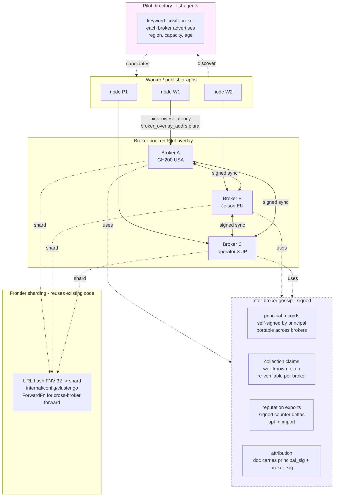

The portability invariants from WS11a are what make this additive instead of a rewrite: principals, collections, attribution, and frontier sharding all already work cross-broker; v2 just adds discovery + gossip + import logic.

---

## Reading order if you only have ten minutes

1. **Diagram 1** — see the three planes and where Pilot sits.
2. **Diagram 2** — see the developer-to-AI-agent loop end to end.
3. **Diagram 13** — see the I9 transport binding (the security spine).
4. **Diagram 11** — see the verification pipeline (the trust spine).
5. **Diagram 6** — see the lease lifecycle (the adoption flywheel).
