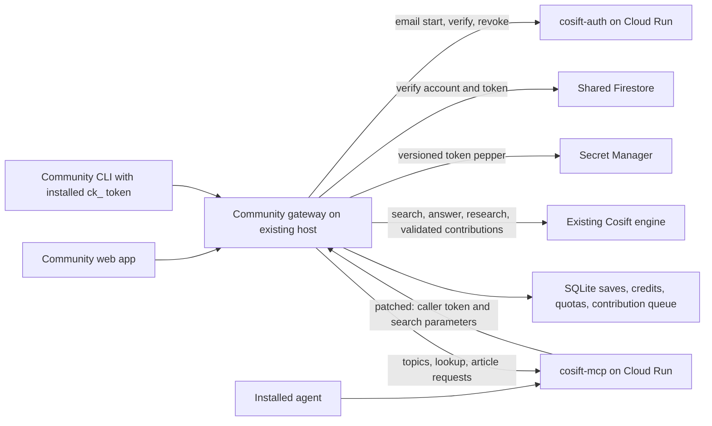

# Connect the community web app and CLI to Andrei's services

This integration is proposed in PR #58. **It has not been deployed.** It adds
shared identity and topic/article-request access to the existing community UI,
CLI, contribution moderation and credit ledger. It does not replace the MCP,
installer, email service, or search engine.

## Verified source contracts

| Component | Reviewed revision | Infrastructure / contract |
|---|---|---|
| [cosift-auth](https://github.com/pilot-protocol/cosift-auth) | `61435108d41789e08ec3832c0ea3cd2c97f520e7` | Go service, Firestore accounts/tokens, versioned Secret Manager peppers; email-code login |
| [cosift-mcp](https://github.com/pilot-protocol/cosift-mcp) | `e7477f21cf5439e1c55a53ddd7d1b0af080342c5` | Python FastMCP, stateless JSON streamable HTTP at `/v1/mcp`; account topics and article demand in Firestore |
| [cosift-install](https://github.com/pilot-protocol/cosift-install) | `3a1d90728dc7e3f99a3cf1f6c29f837054d80460` | Installs MCP/skills and authenticates agents; its existing `ck_` token can authenticate the community CLI |

Project: `telepat-cosift-5214`, number `301038218064`, region `us-west1`.
Firestore databases: `staging` and `(default)` for production. Account UID is the
16-character ID in `accounts/{uid}`. Community never derives it or accesses the
OTP pepper. Its local `shared_identities` table maps that UID to the existing
SQLite user ID, preserving saved requests, submissions, balances and payments.
A verified email can link an existing standalone account; all its old sessions
and password hash are invalidated. Subsequent requests resolve the same UID.
The database is permanently bound to the chosen project/database namespace;
switching to a different environment or disabling shared auth is refused.



The gateway does not send user tokens to the engine. Search stays on the existing
engine, with authenticated `k` bounded to 1–20 and `retriever` restricted to
`bm25`, `dense`, or `hybrid`. MCP's current `k=20&retriever=bm25` contract is
preserved. No new ranking change is included.

## What the connected app does

- Shared mode uses email-code login through `cosift-auth`. The browser receives
  an HttpOnly, SameSite cookie, not a token in JavaScript or local storage.
  Logout revokes the browser's token upstream. `/auth/start` deliberately returns
  the same envelope when mail is refused; the UI never promises mail delivery.
- Every authenticated request checks Firestore token revocation and account ban
  state. Only versioned pepper bytes are cached. Unknown/revoked credentials
  fail with 401, suspended accounts with 403, and infrastructure failures with
  503. An invalid credential never becomes a guest request.
  Cloud Run IAM rejections are distinguished from Cosift's JSON auth errors;
  a gateway permission failure does not label the user banned or revoked.
- Onboarding adds explicitly selected interests to the same followed topics
  used by agents. It does not erase existing agent topics. Editing local interest
  suggestions does not implicitly unfollow topics; use the topic controls.
- The Topics view lists up to 100 topics/requests, adds/removes followed topics,
  checks article coverage, and explicitly records article requests through MCP.
  MCP keeps requested-topic history after unfollowing. Duplicate article requests
  are idempotent upstream.
- Search, Answer, Research, saved requests, URL/CSV contributions, local text /
  metadata / embedding contributions, moderation, credits and disabled-by-default
  Stripe purchases retain the existing community implementation.
- Web, CLI and patched MCP searches share each account's local allowance and
  credit ledger. MCP retains its own upstream daily call cap (currently 1,000),
  including topic tools. Credits do not bypass that cap or buy an article.

Andrei's current MCP uses `NullArticleStore` with articles disabled. This work
connects article lookup/demand; it does **not** implement article generation,
Gemini research, a distributed contributor network, or rewards for article views.
Lookups can return no coverage while regular source-page search remains usable.
No local agent history is collected or uploaded by this integration.

## Runtime configuration

Keep standalone installations on `COSIFT_AUTH_MODE=local` (the default), with
email/password login and no Google credentials. To opt into shared accounts,
provision explicit environment values in the existing private service env file:

```dotenv
COSIFT_AUTH_MODE=shared
COSIFT_SHARED_PROJECT=telepat-cosift-5214
COSIFT_SHARED_DATABASE=staging
COSIFT_AUTH_URL=https://cosift-auth-staging-301038218064.us-west1.run.app
COSIFT_MCP_URL=https://cosift-mcp-staging-301038218064.us-west1.run.app/v1/mcp
COSIFT_AUTH_AUDIENCE=https://cosift-auth-staging-301038218064.us-west1.run.app
COSIFT_MCP_AUDIENCE=https://cosift-mcp-staging-301038218064.us-west1.run.app
GOOGLE_APPLICATION_CREDENTIALS=/etc/cosift/google-credentials.json
```

Resolve the actual Cloud Run URLs with `gcloud run services describe` before
setting these example values; use the service's accepted canonical audience.
The audiences have no MCP path. For public origins leave audiences empty.
Never mix staging services with `(default)` Firestore, or share a local SQLite
account database across the two environments. Start staging with a fresh data
directory. Shared mode requires all four project/database/auth/MCP settings.

The existing engine and local community service can stay on the current GH200
host. The Google clients use ADC; a Google service-account credential or a
supported impersonated ADC configuration must be provisioned for the Unix user
running the community unit. No runtime `gcloud` subprocess or hour-long pasted
Google JWT is used. Private Cloud Run calls put refreshing Google identity tokens
in `X-Serverless-Authorization`; the user's `ck_` stays in `Authorization`.
The browser never receives the Google credential. Existing systemd sandboxing
must permit reading the private ADC file and outbound HTTPS/gRPC.

Required IAM, to be provisioned by the infrastructure owner:

- Firestore account/token reads, collection-group token queries and token
  `last_used_at` updates in the selected database. The existing collection-group
  index on `tokens.tid` must be present. The application does not create accounts
  or issue tokens directly in Firestore.
- Secret accessor on **`cosift-token-pepper` only**, including the active version
  IDs carried by tokens. Never grant this application the OTP or mail secrets.
- Cloud Run invoker on the chosen auth/MCP services when private. For an
  impersonation setup, the caller also needs the relevant identity-token minting
  permission on its designated service account.

Using private `run.app` origins lets the gateway connect directly without new
DNS records or an `allUsers` policy exception. Public agent installation remains
Andrei's separate release/ingress concern. Do not change organization policy as
part of applying this PR. With valid cloud credentials, inspect effective policy
before choosing public Cloud Run ingress: Google also supports disabling the
invoker IAM check where the managed require-invoker constraint permits it.

## Email-code proxy attribution: required before rollout

Auth currently has a 10-codes/hour/IP cap. Proxying without correct attribution
collapses every web user into the community host's one bucket. The gateway now
sends **its resolved client IP**, not the caller's raw forwarding headers, to auth
in `X-Forwarded-For`. Caddy/community trusted-proxy configuration remains required.

Use auth's existing `AUTH_XFF_MODE=cidr` resolver with explicit trusted platform
peer CIDRs and the community gateway's **actual egress IP**. The last observed
host IP was `192.222.56.72`; verify egress rather than assuming it. Cloud Run uses
link-local container peers; inspect the real staging forwarding chain to identify
the appropriate trust set. Do not blindly trust arbitrary private networks, all
addresses, or caller-supplied IP headers. A direct run.app client must still resolve
to its actual address, even if it forges a forwarding chain.

`integrations/cosift-auth/proxy-configuration.patch` makes the auth deploy script
preserve the selected resolver mode and `AUTH_TRUSTED_PROXIES`; its current script
hardcodes hop mode. Apply it only to the pinned auth revision in a reviewed change.
No auth runtime/schema modification is needed. Merely increasing the global hop
count on a public auth service is unsafe and is not the proposed solution.

Staging acceptance: two clients behind the gateway retain separate auth buckets;
a direct caller with a forged XFF header cannot choose its bucket; real email
start/verify succeeds; Google credential refresh survives its initial lifetime.
The repo's IP-resolver tests pass, but these deployment-chain checks remain open.

## CLI usage

The connected installer can provision an already installed, compatible Cosift
CLI with the same token used by the agent. It writes a 0600, origin-bound session
to `${XDG_CONFIG_HOME:-$HOME/.config}/cosift/community-session.json`. Subsequent
`cosift request -query 'Rust async runtimes'` or `cosift contribute -credits`
commands discover that one session and its server automatically. Explicit
credentials and session selection take precedence; an explicit different server
is rejected before any credential is sent. Guest mode never reads the installed
session. Existing installer sessions are preserved rather than overwritten.

Reuse the `ck_` credential already issued by Andrei's installer by providing it
as `COSIFT_TOKEN` in the calling process. Do not put it in shell command arguments
or commit it to config. The community CLI does not automatically scan harness
files or export credentials from other applications.

```sh
# COSIFT_TOKEN is already supplied securely in the process environment.
cosift contribute -server https://cosift.pilotprotocol.network -request -query 'Rust async runtimes'
cosift contribute -server https://cosift.pilotprotocol.network -credits
cosift contribute -server https://cosift.pilotprotocol.network -index-locally https://example.org/article
# Or explicitly persist the verified credential in an origin-bound 0600 file:
cosift login -server https://cosift.pilotprotocol.network -session-file "$HOME/.cosift-community-session"
```

Use `cosift request` for the dedicated request subcommand, or `contribute -request`
as above. Local indexing still needs configured embeddings and is revalidated
by the server before earning credits. Direct token commands never mint or revoke
a temporary login session. `-guest` ignores the token. After saving a session,
unset `COSIFT_TOKEN` before selecting that session file; conflicting credentials
are rejected. Explicit CLI logout revokes the saved credential upstream, so a
saved installer token is also revoked for any agent still using that same token.
Standalone email/password and existing session-file workflows remain supported.
`cosift logout` discovers and revokes the installed session too, including an
expired one; a temporary upstream failure retains the file so logout can be
retried. Revoking that token also invalidates agents using the same token.

## MCP companion change and rollout boundary

`integrations/cosift-mcp/forward-account-token.patch` is based on the pinned MCP
revision above. It carries the already-verified token in request-scoped state,
passes it to the engine client for each search, requires HTTPS except loopback,
and refuses credential redirects. It never changes shared client default headers.
Point `COSIFT_ENGINE_BASE_URL` at the community origin, not the raw engine port.
The included tests cover concurrent accounts and credential leakage boundaries.

Both companion patches are **artifacts inside this PR**. They were applied and
tested only in local audit checkouts, not pushed, merged or deployed in Andrei's
repositories. Review and land those companion changes before routing production
MCP searches through the gateway. Keep the original production engine/UI in place
until staging and the [community rollout gates](COMMUNITY-ROLLOUT.md) pass.
Back up the local database before linking existing users; do not downgrade a
linked database to standalone password auth or restore a stale credit ledger.

## Evidence and remaining work

See [the integration verification record](SHARED-ACCOUNTS-VALIDATION.md) for exact
commands and test scope. Real Cloud Run / Firestore / Secret Manager access was
not verified in this sweep: the available gcloud login required reauthentication.
Production readiness additionally requires provisioning the gateway identity,
verifying IAM/index access and email/IP attribution in staging, applying the MCP
companion, and completing the existing model, capacity and payment rollout gates.

Security note: the audited auth revision also pins gRPC v1.82.1. Its owner should
review/update that dependency before its production release; our gateway uses
v1.83.2 to address [GO-2026-6348](https://pkg.go.dev/vuln/GO-2026-6348) and the
related gRPC advisories. The auth companion in this PR changes proxy deployment
configuration only, not its dependencies or live services.
